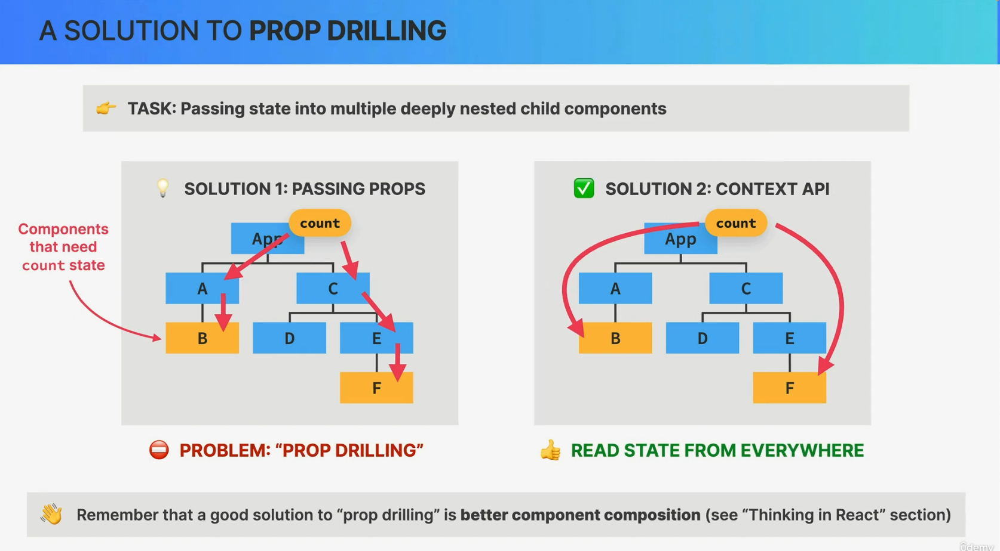
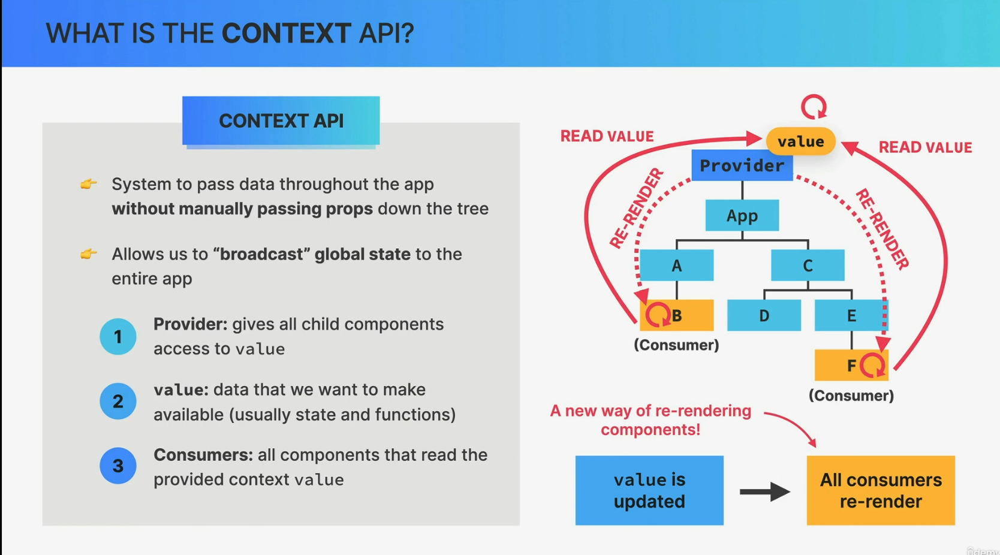
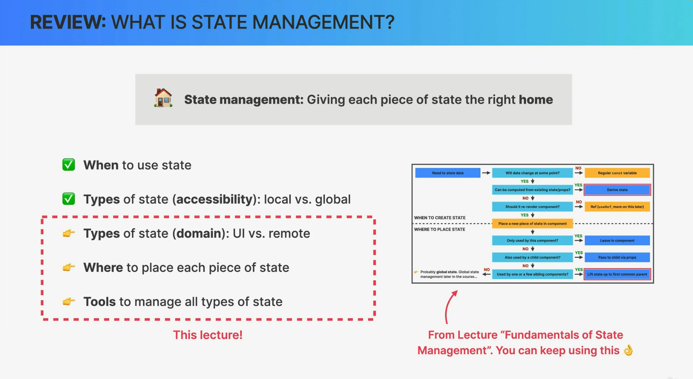
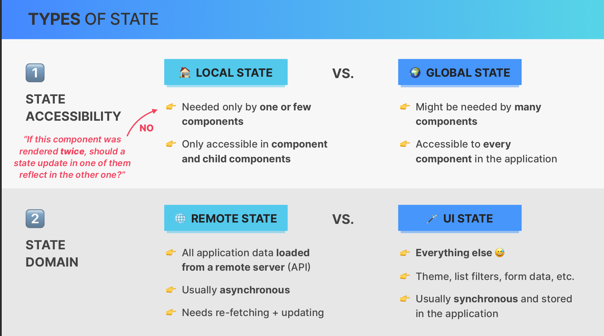
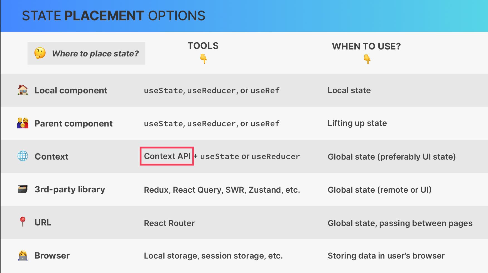
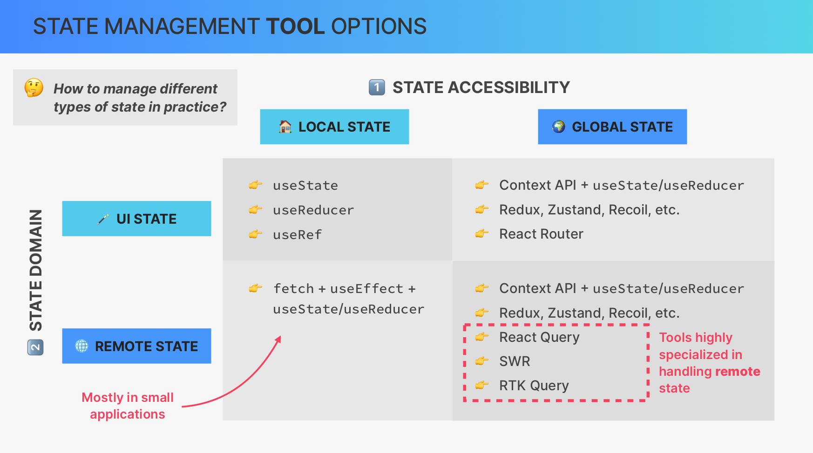
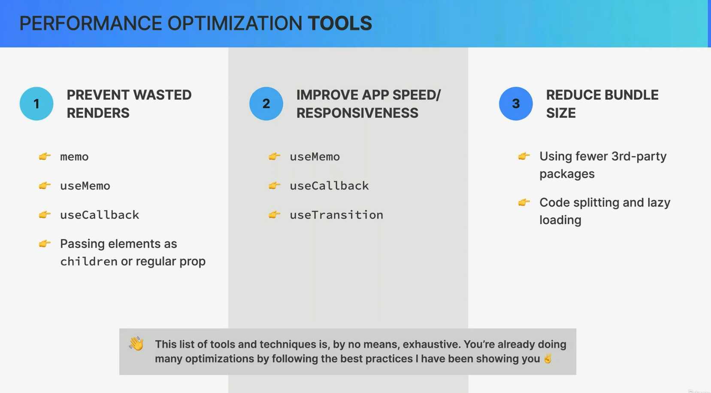
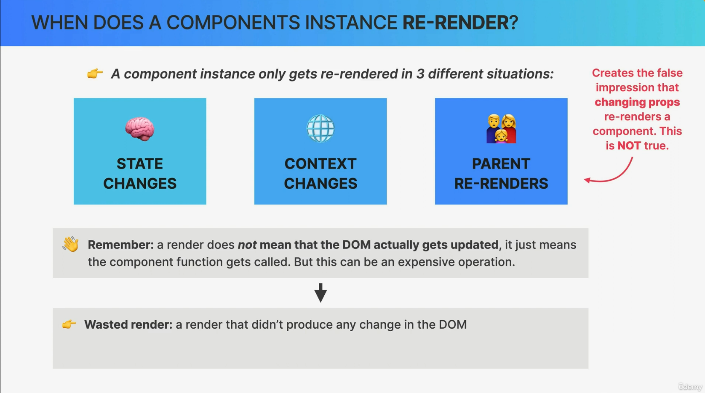
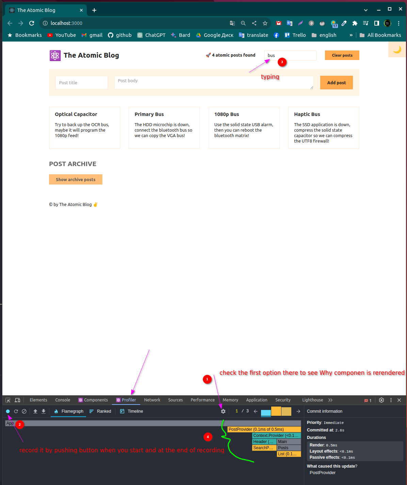
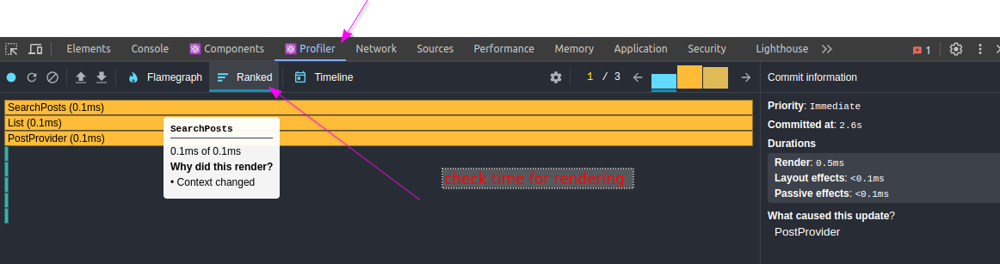

# context API





**Context API** is a solution provided by React for managing and sharing state or data across multiple components in a more efficient way, especially when dealing with prop drilling becomes cumbersome. It allows you to create a central store of data that can be accessed by any component in your application without the need to pass props down the component tree manually.

Here's how you can use the Context API to address prop drilling:

**1. Create a Context**:

First, you need to create a context using the `createContext` function from React.

```jsx
import React, { createContext, useContext, useState } from "react";

// Create a context with an initial value (optional)
const MyContext = createContext();
```

**2. Provide Data**:

Wrap your entire application or the part of your application where you want to share data with a `Provider` component. The `Provider` component will supply the data to all components within its subtree.

```jsx
function App() {
  const [data, setData] = useState("Some data to share");

  return (
    <MyContext.Provider value={data}>
      {/* Rest of your application */}
    </MyContext.Provider>
  );
}
```

**3. Consume Data**:

In any component where you want to access the shared data, use the `useContext` hook to consume the context.

```jsx
function MyComponent() {
  const sharedData = useContext(MyContext);

  return <div>{sharedData}</div>;
}
```

By using the Context API, you can avoid prop drilling and directly access the shared data from any component within the context's provider. This makes it easier to manage global or shared state without passing props through intermediary components.

**Advanced Usage**:

- You can create multiple contexts for different parts of your application if needed.
- Context can also hold functions or objects, not just simple values.
- To update the context data, you can pass callback functions as part of the context value.

However, it's important to use context judiciously and not overuse it for every piece of shared data in your application, as it may make your code less predictable and harder to maintain in some cases. Consider using context for global state or shared data that genuinely needs to be accessible from multiple parts of your application.

# types of state









## 1. state accessibility = local vs global

## 2. state domain = remote state vs UI state

Certainly, let's break down the two types of state you mentioned:

**1. State Accessibility: Local vs. Global State**

State accessibility refers to how and where you can access and manage the state within your application. It is typically categorized as either local state or global state.

**Local State**:

- **Scope**: Local state is limited in scope and is typically used within a specific component.
- **Accessibility**: It is accessible and manageable only within the component that defines it.
- **Use Cases**: Local state is suitable for managing component-specific data that doesn't need to be shared with other components. For example, form input values, local UI toggles, or temporary component-specific data.

**Global State**:

- **Scope**: Global state is available and accessible across multiple components.
- **Accessibility**: It can be accessed and managed from various parts of the application, making it suitable for sharing data between different components or managing application-wide state.
- **Use Cases**: Global state is used for scenarios where data needs to be shared between multiple components, such as user authentication status, application theme, shopping cart contents, or any data that many parts of the application need to access and update.

**2. State Domain: Remote State vs. UI State**

State domain refers to the nature of the state and whether it represents remote data fetched from a server or UI-related data used for rendering components.

**Remote State**:

- **Nature**: Remote state represents data that is fetched from external sources, typically from an API or a server.
- **Usage**: It is used to store and manage data that originates from server requests, such as user profiles, product listings, comments, or any data that requires asynchronous fetching.
- **Management**: Remote state often involves asynchronous operations like data fetching, sending requests, and handling responses.

**UI State**:

- **Nature**: UI state represents data that is related to the user interface and how components are displayed.
- **Usage**: It is used for managing local UI-related data, such as component visibility, user interactions (e.g., form input values), component styles, and temporary display-related data.
- **Management**: UI state is typically managed within the client application and doesn't involve external data fetching.

In practice, applications often have a combination of both local and global state, as well as remote and UI state. Understanding these distinctions helps in organizing and managing state more effectively in React applications. Depending on the type of state and its purpose, you can choose the appropriate state management techniques and libraries, such as React's built-in state management, context API, or external state management libraries like Redux or MobX.

## state placement options: tools and when to use?

1. local component
2. parent conponent
3. context
4. 3rd party library
5. URL
6. browser

State placement options in a React application determine where and how you manage and share state data. Each option has its use cases and is suitable for different scenarios. Here's an overview of these options and when to use them:

**1. Local Component State**:

- **Tools**: React's built-in `useState` hook or `this.state` (in class components).
- **When to Use**:
  - Use local component state for managing data that is specific to a single component and doesn't need to be shared with other components.
  - Ideal for UI-related state like form input values, local component visibility, and temporary data.

**2. Parent Component State**:

- **Tools**: Pass data as props from a parent component to its children.
- **When to Use**:
  - Use parent component state when you need to share data between parent and child components.
  - Suitable for scenarios where child components depend on data provided by their parent.

**3. Context API**:

- **Tools**: React's Context API (created with `createContext`) and the `useContext` hook.
- **When to Use**:
  - Use context for sharing data across multiple components in your application, especially when passing props through many intermediate components becomes impractical (prop drilling).
  - Suitable for managing global application state, themes, user authentication, and other shared data.

**4. Third-Party State Management Libraries**:

- **Tools**: Libraries like Redux, MobX, Recoil, and Zustand.
- **When to Use**:
  - Consider using third-party state management libraries when your application's state management needs become complex or require advanced features like time-travel debugging or middleware.
  - Ideal for larger applications with a significant amount of shared state or when strict data flow control is necessary.

**5. URL Parameters (React Router)**:

- **Tools**: React Router's `useParams` hook or the `match.params` in class-based components.
- **When to Use**:
  - Use URL parameters to capture and manage dynamic data from the URL.
  - Useful for scenarios like viewing user profiles with different IDs or displaying product details with unique identifiers.

**6. Browser Storage (localStorage, sessionStorage)**:

- **Tools**: JavaScript's `localStorage` and `sessionStorage` APIs.
- **When to Use**:
  - Use browser storage for persisting data across sessions or sharing data between different browser tabs or windows.
  - Useful for implementing features like user preferences, shopping cart persistence, and caching.

The choice of state placement depends on your application's specific requirements and architecture. In many cases, you may use a combination of these options to handle different types of state within your application. It's essential to consider factors such as data scope, sharing requirements, and the complexity of your application when deciding which state placement option(s) to use.

# performance optimization tools: 1. prevent wasted renders 2. improve app speed/responsiveness 3. reduce bundle size



Performance optimization is a crucial aspect of building efficient and responsive React applications. To achieve these goals, you can use various tools, techniques, and best practices. Here are tools and strategies to address each of the mentioned optimization goals:

**1. Prevent Wasted Renders**:

- **React.memo**: It's a higher-order component (HOC) that can be used to memoize functional components, preventing unnecessary re-renders when their props haven't changed.

- **useMemo and useCallback**: These hooks allow you to memoize values and functions, respectively, to avoid recomputation during renders.

- **Use the shouldComponentUpdate lifecycle method** (for class components): Implementing this method allows you to define custom logic for when a component should or shouldn't re-render.

- **React DevTools**: The React DevTools extension provides insights into component renders and can help you identify components that re-render excessively.

**2. Improve App Speed/Responsiveness**:

- **Code Splitting**: Use tools like Webpack's dynamic imports to split your application code into smaller chunks. This can lead to faster initial load times and improved perceived performance.

- **Lazy Loading**: Implement lazy loading for components or assets that are not immediately needed when the app loads, improving load times.

- **React Profiler**: React Profiler is a tool included in React DevTools that allows you to identify performance bottlenecks and areas of improvement in your application.

- **Performance Monitoring Tools**: Tools like Google Lighthouse, WebPageTest, and GTmetrix can help you analyze your app's performance, identify bottlenecks, and suggest optimizations.

- **Service Workers**: Implementing service workers for offline caching and background fetching can significantly improve app responsiveness, especially for progressive web apps (PWAs).

**3. Reduce Bundle Size**:

- **Code Splitting**: As mentioned earlier, code splitting helps reduce bundle size by breaking your application into smaller, more manageable chunks that are only loaded when needed.

- **Tree Shaking**: Tree shaking is a technique used by modern bundlers (e.g., Webpack) to eliminate unused code or dependencies from the final bundle, reducing its size.

- **Minification**: Use minification tools like Terser to remove unnecessary whitespace, comments, and reduce variable names, resulting in smaller bundle sizes.

- **Compression**: Enable Gzip or Brotli compression for your server to reduce the size of assets sent over the network.

- **Analyze Bundle**: Tools like Webpack Bundle Analyzer help you visualize the size of your application's bundle and identify areas where you can make optimizations.

- **Code Splitting Strategies**: Implement advanced code splitting strategies such as route-based splitting, conditional splitting, and shared bundles to further reduce bundle size.

Remember that optimizing for performance is an ongoing process. Regularly monitor your application's performance, run audits, and keep an eye on the latest best practices and tools in the React and web development communities to ensure your app remains fast and efficient as it evolves.

## when does a components instance re-render?



In React, a component's instance (also referred to as a component instance or component) re-renders under specific conditions. Understanding when and why a component re-renders is crucial for optimizing the performance of your React application. Here are some scenarios in which a component instance may re-render:

1. **Props Change**:

   - When the component receives new props from its parent component or container.
   - Re-renders occur when the `props` passed to the component change, regardless of whether the new props are different from the previous props.

2. **State Change**:

   - When the component's local state changes using `this.setState` (in class components) or the `useState` hook (in functional components).
   - React compares the new state with the previous state and triggers a re-render if there are differences.

3. **Context Change**:

   - When the component consumes context using the `useContext` hook or `Context.Consumer` (in class components).
   - A re-render happens when the context value provided by a parent component changes.

4. **Force Re-render**:

   - You can explicitly force a re-render of a component using methods like `this.forceUpdate()` (in class components) or a state update with `useState` (in functional components) even if the props and state haven't changed. However, this is generally discouraged and should be used sparingly.

5. **Lifecycle Methods or Effects**:

   - Re-renders may occur when you use lifecycle methods (in class components) or the `useEffect` hook (in functional components) to perform side effects or update state. Depending on how these methods are used, they may trigger re-renders.

6. **Parent Component Re-renders**:

   - When a component's parent re-renders, its children also re-render by default. This behavior is usually optimized by React, and not all children may re-render if their props and state haven't changed.

7. **Component's Force Re-render**:

   - Some state management libraries or tools may provide mechanisms to force a component to re-render, even if its props and state haven't changed.

8. **PureComponent or React.memo**:

   - Components that extend `PureComponent` (in class components) or use `React.memo` (in functional components) perform a shallow comparison of props to determine if a re-render is necessary. If the props haven't changed, the component won't re-render.

9. **React DevTools and Time Slicing**:
   - React DevTools may trigger re-renders when inspecting components in development mode.
   - React's Concurrent Mode, which enables time slicing, may introduce more granular re-renders to improve the responsiveness of the application, even if props and state haven't changed.

It's important to note that React is designed to optimize re-renders and avoid unnecessary work. React's reconciliation process compares the previous and current virtual DOM representations and updates the actual DOM only when needed. This makes React efficient and performant, especially when used correctly and following best practices.

# devtools react Profiler





The React Profiler is a powerful tool included in React DevTools that allows you to analyze the performance of your React application, identify performance bottlenecks, and gain insights into how your components render. It's particularly helpful for diagnosing and optimizing the rendering and update cycles of your components.

Here's an overview of how to use the React Profiler:

**1. Install React DevTools**:

Make sure you have the React DevTools extension installed in your browser. You can download it from the Chrome Web Store or Firefox Add-ons.

**2. Open React DevTools**:

Open your application in the browser, and then open the React DevTools extension by clicking on its icon in the browser's toolbar.

**3. Switch to the Profiler Tab**:

In the React DevTools panel, switch to the "Profiler" tab. This tab is dedicated to profiling your React application.

**4. Start Profiling**:

Click the "Start Profiling" button to begin profiling your application. This will record performance data as your application runs.

**5. Interact with Your Application**:

Perform actions or interactions in your application that you want to profile. For example, navigate to different pages, click buttons, or interact with UI elements. The Profiler will record data during these interactions.

**6. Stop Profiling**:

Once you've gathered enough data, click the "Stop Profiling" button to stop the profiling session.

**7. Analyze the Profiling Results**:

After stopping the profiling session, you'll see a flame chart and a summary of the profiling results. The flame chart visually represents the rendering and update cycles of your components.

- **Main Thread**: The main thread contains information about your components' render and commit phases.
- **Interactions**: Interactions represent the user interactions (e.g., clicks) that you triggered during profiling.

**8. Identify Performance Issues**:

- Look for components that take a long time to render or update. These components are represented as bars in the flame chart.
- Pay attention to the interactions and how they impact component rendering. You can click on interactions to see which components were affected.

**9. Optimize Your Code**:

Based on the profiling results, you can make optimizations to your code. This might involve:

- Reducing unnecessary renders by using `React.memo`, `useMemo`, or `useCallback`.
- Splitting large components into smaller ones to improve rendering performance.
- Minimizing the number of expensive calculations or side effects in your components.
- Utilizing React's built-in performance optimization tools.

**10. Rerun Profiling**:

Repeat the profiling process after making optimizations to ensure that your changes have improved the performance of your application.

The React Profiler is a valuable tool for diagnosing performance issues in React applications. By using it regularly, you can ensure that your application remains fast and responsive as it evolves and grows.

# memoization

Memoization is an optimization technique used to improve the performance of functions by caching the results of expensive function calls and returning the cached result when the same inputs occur again. This can be especially useful in scenarios where a function is called with the same arguments multiple times, and you want to avoid redundant computations.

Here's how memoization works and how to implement it in JavaScript:

**Basic Memoization Example**:

```javascript
function expensiveOperation(n) {
  console.log(`Computing expensiveOperation(${n})...`);
  // Simulate a time-consuming calculation
  let result = 0;
  for (let i = 0; i < n; i++) {
    result += i;
  }
  return result;
}

// Basic memoization function
function memoize(func) {
  const cache = new Map();
  return function (n) {
    if (cache.has(n)) {
      console.log(`Cache hit for ${n}`);
      return cache.get(n);
    } else {
      console.log(`Cache miss for ${n}`);
      const result = func(n);
      cache.set(n, result);
      return result;
    }
  };
}

const memoizedExpensiveOperation = memoize(expensiveOperation);

console.log(memoizedExpensiveOperation(5)); // Computes and caches result for 5
console.log(memoizedExpensiveOperation(5)); // Retrieves result from cache for 5 (no recomputation)
console.log(memoizedExpensiveOperation(10)); // Computes and caches result for 10
console.log(memoizedExpensiveOperation(10)); // Retrieves result from cache for 10 (no recomputation)
```

In this example:

1. The `expensiveOperation` function performs a time-consuming calculation.

2. The `memoize` function is a higher-order function that takes a function (`func`) as an argument and returns a new function. This new function caches the results of `func` in a `Map` object.

3. When you call `memoizedExpensiveOperation(n)`, it first checks if the result for the given input `n` is already in the cache. If it's found, it returns the cached result. Otherwise, it computes the result, stores it in the cache, and returns it.

Memoization can significantly improve the performance of functions that have expensive computations or I/O operations, as it reduces redundant work by reusing cached results. It's commonly used in various contexts, including optimizing recursive algorithms, web applications, and data processing. Libraries like `lodash.memoize` and `reselect` provide advanced memoization capabilities for React applications and other JavaScript projects.

# Getting Started with Create React App

This project was bootstrapped with [Create React App](https://github.com/facebook/create-react-app).

## Available Scripts

In the project directory, you can run:

### `npm start`

Runs the app in the development mode.\
Open [http://localhost:3000](http://localhost:3000) to view it in your browser.

The page will reload when you make changes.\
You may also see any lint errors in the console.

### `npm test`

Launches the test runner in the interactive watch mode.\
See the section about [running tests](https://facebook.github.io/create-react-app/docs/running-tests) for more information.

### `npm run build`

Builds the app for production to the `build` folder.\
It correctly bundles React in production mode and optimizes the build for the best performance.

The build is minified and the filenames include the hashes.\
Your app is ready to be deployed!

See the section about [deployment](https://facebook.github.io/create-react-app/docs/deployment) for more information.

### `npm run eject`

**Note: this is a one-way operation. Once you `eject`, you can't go back!**

If you aren't satisfied with the build tool and configuration choices, you can `eject` at any time. This command will remove the single build dependency from your project.

Instead, it will copy all the configuration files and the transitive dependencies (webpack, Babel, ESLint, etc) right into your project so you have full control over them. All of the commands except `eject` will still work, but they will point to the copied scripts so you can tweak them. At this point you're on your own.

You don't have to ever use `eject`. The curated feature set is suitable for small and middle deployments, and you shouldn't feel obligated to use this feature. However we understand that this tool wouldn't be useful if you couldn't customize it when you are ready for it.

## Learn More

You can learn more in the [Create React App documentation](https://facebook.github.io/create-react-app/docs/getting-started).

To learn React, check out the [React documentation](https://reactjs.org/).

### Code Splitting

This section has moved here: [https://facebook.github.io/create-react-app/docs/code-splitting](https://facebook.github.io/create-react-app/docs/code-splitting)

### Analyzing the Bundle Size

This section has moved here: [https://facebook.github.io/create-react-app/docs/analyzing-the-bundle-size](https://facebook.github.io/create-react-app/docs/analyzing-the-bundle-size)

### Making a Progressive Web App

This section has moved here: [https://facebook.github.io/create-react-app/docs/making-a-progressive-web-app](https://facebook.github.io/create-react-app/docs/making-a-progressive-web-app)

### Advanced Configuration

This section has moved here: [https://facebook.github.io/create-react-app/docs/advanced-configuration](https://facebook.github.io/create-react-app/docs/advanced-configuration)

### Deployment

This section has moved here: [https://facebook.github.io/create-react-app/docs/deployment](https://facebook.github.io/create-react-app/docs/deployment)

### `npm run build` fails to minify

This section has moved here: [https://facebook.github.io/create-react-app/docs/troubleshooting#npm-run-build-fails-to-minify](https://facebook.github.io/create-react-app/docs/troubleshooting#npm-run-build-fails-to-minify)
